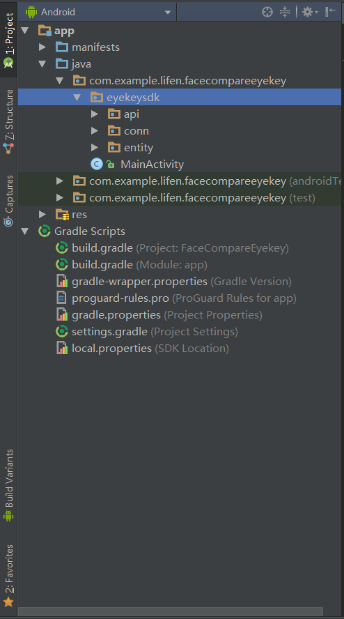
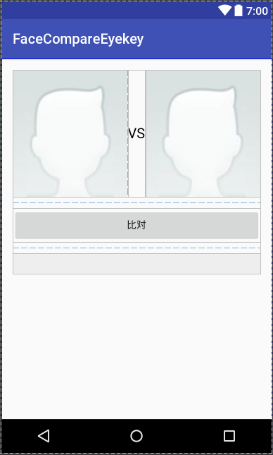

# FaceCompareEyekey
## [安卓]Eyekey人脸识别1：1对比

本项目采用了eyekey 第三方接口，实现了自选图片人脸识别和 两张图片的1：1对比，可返回比对相似度信息，具体步骤如下： 

## 一、所需权限 

```xml
<uses-permission android:name="android.permission.INTERNET"/>
<uses-permission android:name="android.permission.WRITE_EXTERNAL_STORAGE"/>
<uses-permission android:name="android.permission.READ_EXTERNAL_STORAGE"/>
```

## 二、第三方app id app key 

```xml
<meta-data android:name="appkey" android:value=""/>
<meta-data android:name="appid" android:value=""/>
```

**本应用采用的eyekey 第三方接口，可自行去注册，以上代码放到配置文件中** 

## 三、添加依赖## 

```groovy
    compile "com.squareup.retrofit2:retrofit:2.1.0"
    compile "com.squareup.retrofit2:converter-gson:2.1.0"
```
### retrofit使用参见: [retrofit使用](/retrofit使用参见.md)
导入sdk,如图放入文件路径下： 



## 四、布局文件 ##

 
